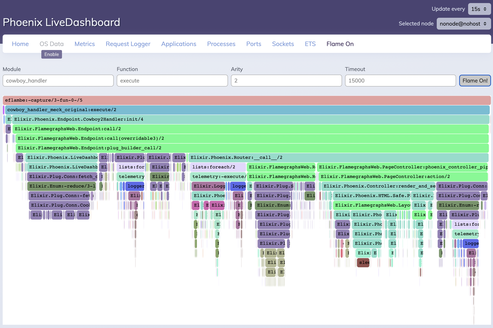

# Flame On



Add Flame Graphs to your Phoenix Application or LiveDashboard

## Getting Started

For more information on flame graphs and an introduction to Flame On, see [the announcement blog post](https://dockyard.com/blog/2022/02/22/profiling-elixir-applications-with-flame-graphs-and-flame-on)

## Installation

Add `:flame_on` to your dependencies:

```elixir
def deps do
  [
    {:flame_on, "~> 0.5.1"}
  ]
end
```

And then add Flame On as a LiveDashboard page or a LiveComponent in your LiveView page

### Flame On as a LiveDashboard page

Modify the `live_dashboard` call in your `Router`:

```elixir
live_dashboard "/dashboard",
  metrics: MyAppWeb.Telemetry,
  additional_pages: [
    flame_on: FlameOn.DashboardPage
  ]
```

You will now find a `Flame On` tab along the top of the LiveDashboard page

### Flame On as a LiveComponent in your own LiveView page

```elixir
<.live_component module={FlameOn.Component} id="flame_on" width="100%" height="100%" />
```

## Usage

Choose the Module, Function, and Arity of the function you want to profile, click "Flame On", and then trigger the function (e.g. make a web request in a new tab). Note that for Elixir modules, you will need to prefix them with `Elixir`, e.g. `Elixir.Phoenix.Controller`, while Erlang modules take simply the erlang module name, e.g. `cowboy_handler`. The default values of `cowboy_handler`/`execute`/`2` are the best way to capture a standard Phoenix Controller DeadView request or the DeadView request that kicks off a LiveView request.

### Zooming

Clicking a block will zoom the flamegraph to that block and recalculate the percents for the blocks such that the clicked block is now 100%. You can return to a higher level block by clicking the link for it above the blocks.

## Running in Production

Flame On should not be run in critical production environments. Flame On uses `:meck` under the hood. This swaps out beam code paths and injects mock code that includes tracing. If you do need to use Flame On in a critical production node to diagnose a specific issue, I recommend rebuilding or restarting that node after running it.

## Running in a Release

`:meck` swaps out code paths and therefore you will need to include the beam files in your release. By default these are stripped, so in your release definition in `mix.exs` add the `strip_beams: false` flag:

```elixir
releases: [
  my_app_web: [
    ...
    strip_beams: false
  ],
```

You may also need to explicitly include `:meck` as a dependency if it can't find it when trying to run in a release.

## Credit

Credit to [eFlambe](https://github.com/Stratus3D/eflambe) for being the original capture engine used by Flame On and the inspiration for the current capture engine.

## Authors

-   [Mike Binns](https://github.com/TheFirstAvenger)

[We are very thankful for the many contributors](https://github.com/DockYard/flame_on/graphs/contributors)

## Versioning

This library follows [Semantic Versioning](https://semver.org)

## Looking for help with your Elixir project?

[At DockYard we are ready to help you build your next Elixir project](https://dockyard.com/phoenix-consulting). We have a unique expertise
in Elixir and Phoenix development that is unmatched. [Get in touch!](https://dockyard.com/contact/hire-us)

At DockYard we love Elixir! You can [read our Elixir blog posts](https://dockyard.com/blog/categories/elixir)

## Legal

[DockYard](https://dockyard.com/), Inc. © 2022

[@DockYard](https://twitter.com/DockYard)

[Licensed under the MIT license](https://www.opensource.org/licenses/mit-license.php)
